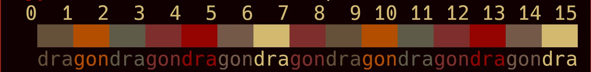

# Hell Eyes
## About
This repository contains ports of theme Hell Eyes for terminal emulators. That
is a redish theme with a creepy and weird appeal.

Here is a preview that you can check out:

## Pallete
These are the colors used in the theme:

| Name                | ANSI | Hex Code  |
| ------------------- | ---- | --------- |
| Black (background)  | 0    | `#100000` |
| Red                 | 1    | `#664f3a` |
| Green               | 2    | `#b34d00` |
| Yellow              | 3    | `#5e5a47` |
| Blue                | 4    | `#7d2e2c` |
| Magenta             | 5    | `#940401` |
| Cyan                | 6    | `#75594a` |
| White (foreground)  | 7    | `#d1b96f` |

### Support
Report issues, questions and suggestions through its [issues page](https://github.com/skippyr/hell-eyes/issues).

## Copyright
This software is under the BSD-3-Clause license. A copy of the license is
bundled with the source code.
